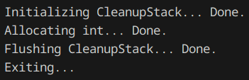

# Cleanup Stack

A barebones C project focused on implementing and managing a cleanup stack.

## Introduction

A cleanup stack is a mechanism used to ensure that resources are properly released in the event of an error or exception. This project demonstrates an implementation of a cleanup stack in C.

## Features

- Simple and memory efficient cleanup stack implementation
- Example usage of the cleanup stack
- Error handling and resource management

## Problems and Optimization

While the cleanup stack implementation in this project is functional and memory efficient, it is not optimal due to how struct alignment works.

In practice, a different implementation would be better.
