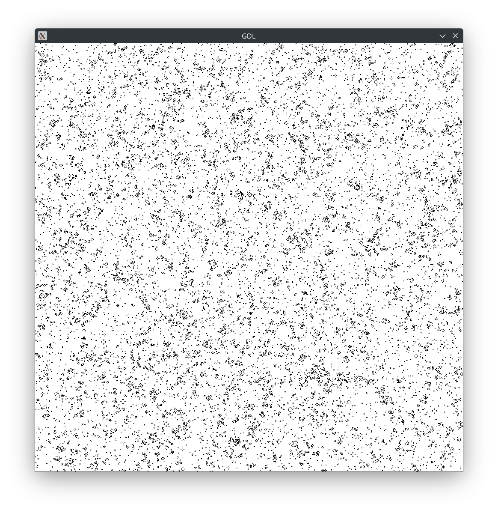

# Game of Life



A barebones CPU-based implementation of Conway's Game of Life in C++.

## Overview

Conway's Game of Life is a cellular automaton, invented by mathematician John Horton Conway. The game simulates the evolution of a grid of cells based on simple rules, resulting in complex, emergent patterns.

## Features

- Minimal dependencies
- Cross-platform compatibility

## Running the Program

After building the project, you can run the program using the following command:

```sh
./builddir/game_of_life/game_of_life
```
