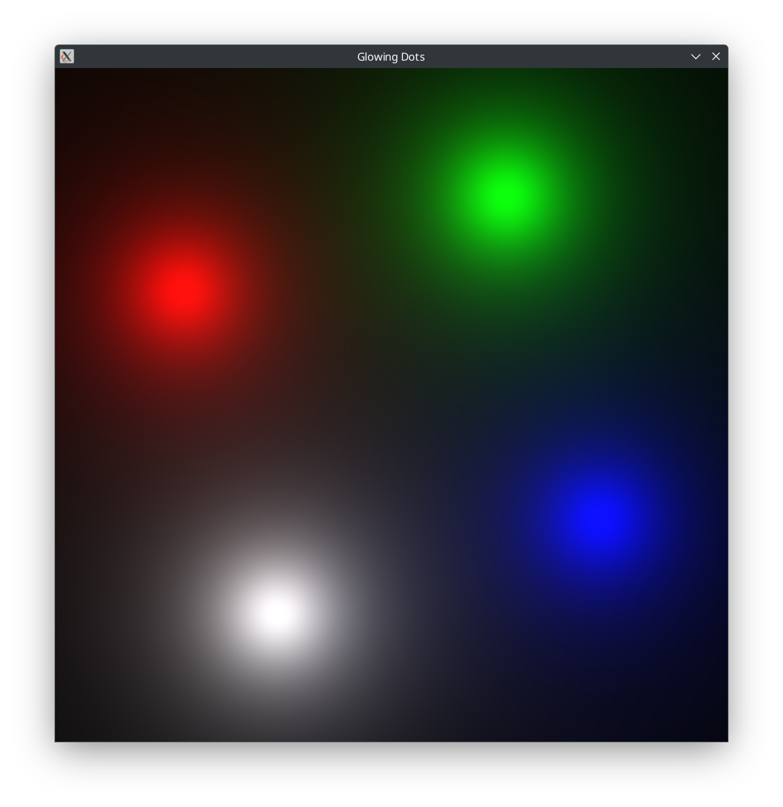

# Glowing Dots Demo



A small CPU-based demo program that I made back in highschool.

[`glowing_dots-rs`](https://github.com/ed-2100/glowing_dots-rs) builds on this project.

## Features

- **Visual Effects**: Renders glowing dots.
- **Performance**: Uses AVX intrinsics to accelerate frame generation.
- **Cross-Platform Compatibility**: Designed to compile on any system supporting SFML.

## Running the Program

After building the project, you can run the program using the following command:

```sh
./builddir/glowing_dots/glowing_dots
```
