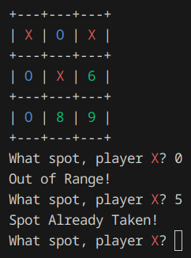
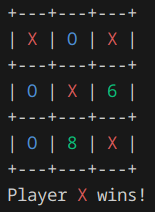

# Tic Tac Toe




## Overview

This project is a simple implementation of the classic Tic Tac Toe game using C++.
The game allows two players to play against each other on a 3x3 grid.

## Features

- Two-player mode
- Simple and intuitive interface
- Error handling for invalid moves
- Detection of win, lose, and draw conditions

### Running the Game

After building the project, you can run the game using the following command:

```sh
./builddir/tictactoe/tictactoe
```
