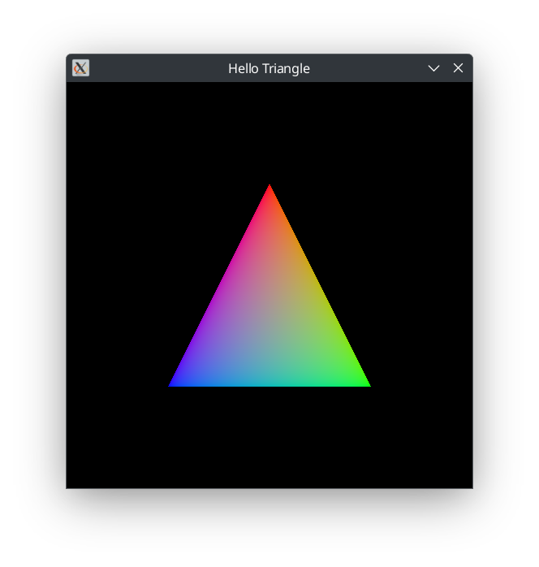

# vk_test



A simple "Hello Triangle" program written in C++.

## Features

- Modularized code structure
- Emphasizes separation of concerns
- Utilizes the Vulkan RAII API

## Running the Program

After building the project, you can run the program using the following command:

```sh
./builddir/glowing_dots/glowing_dots
```
